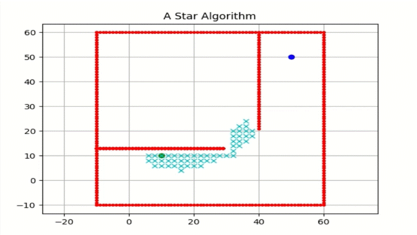
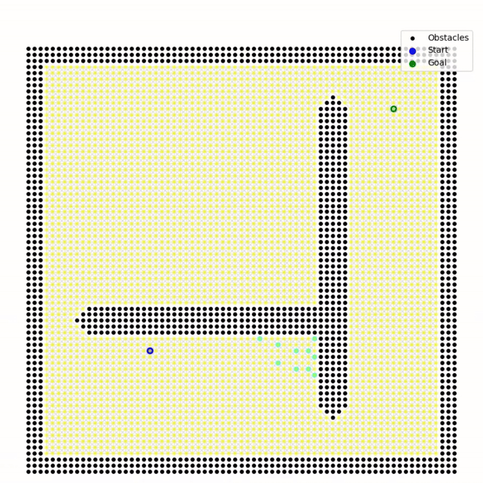
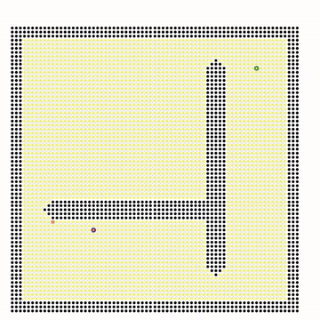
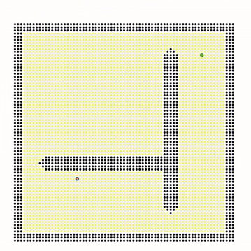

# 🚀 Advanced Path Planning Algorithms for Intelligent Mobile Robots

## 📌 Overview
This repository contains implementations of various **advanced path-planning algorithms** used in autonomous mobile robots. These algorithms are widely applied in **robotics, AI, and autonomous navigation systems**. 

The repository includes implementations of:
- **A\***, **D\***, **Hybrid DQN-A\***, **RRT\***, and **Theta\*** algorithms.
- Efficient solutions for **navigation in dynamic and static environments**.

---

## ✨ Features
✔ **A\* Algorithm** - Implements the classical A\* search and bidirectional variant for optimal path planning.  
✔ **D\* Algorithm** - A dynamic path planning algorithm that adapts to changing environments.  
✔ **Hybrid DQN-A\*** - A hybrid approach combining Deep Q-Network (DQN) with A\* for intelligent decision-making.  
✔ **RRT\* Algorithm** - Rapidly-exploring Random Tree (RRT\*) for sampling-based path planning.  
✔ **Theta\* Algorithm** - An optimized variant of A\* allowing any-angle path planning.  

---

## 📂 Directory Structure
```plaintext
Advanced_Path_Planning
│── A_Star
│   ├── README.md
│   ├── a_star_algorithm.py
│   ├── a_star_bidirectional_algorithm.py
│
│── D_Star
│   ├── README.md
│   ├── d_star.py
│
│── Hybrid_DQN_A_Star
│   ├── README.md
│   ├── hybrid_dqn_a_star_algorithm.py
│
│── RRT_Star
│   ├── README.md
│   ├── rrt_star_algorithm.py
│
│── Theta_Star
│   ├── README.md
│   ├── theta_star_algorithm.py
│
│── media
│   ├── astar.gif
│   ├── astar_bidirectional.gif
│   ├── dstar.gif
│   ├── dqn_astar.gif
│   ├── rrtstar.gif
│   ├── thetastar.gif
│
│── test
│   ├── test_astar.py
│   ├── test_dstar.py
│   ├── test_hybrid_dqn_a_star.py
│   ├── test_rrt_star.py
│   ├── test_theta_star.py
│
│── .gitignore
│── LICENSE
│── README.md
│── requirements.txt
│── setup.py
│── .github

```

---

## ⚙️ Installation
To run the algorithms, install the necessary dependencies:
```sh
pip install -r requirements.txt
pip install -e .

```

---

## 🚀 Usage
Each algorithm can be executed independently. Example usage:
```sh
python A_Star/a_star_algorithm.py
            or
pytest -v --verbose
```
Modify the scripts as needed to test different environments or configurations.

---

## 📊 Project Overview
The project contains several advanced path planning techniques, including:
### 🔹 **A\* Algorithm**
A classic grid-based path planning method that computes the optimal path using an 8-connected graph and a Euclidean distance heuristic.  


### 🔹 **Bidirectional A\***
An enhanced version of A\* that simultaneously searches from the start and goal, potentially reducing the search time.  


### 🔹 **D\* Algorithm**
A dynamic path planning algorithm that efficiently updates the optimal path in response to changes in the environment.  


### 🔹 **RRT\* Algorithm**
A rapidly exploring random tree (RRT) is an algorithm designed to efficiently search nonconvex, high-dimensional spaces by randomly building a space-filling tree.  


### 🔹 **Theta\* Algorithm**
An any-angle variant of A\* that uses line-of-sight checks to "shortcut" unnecessary nodes, producing smoother and more direct paths.  


### 🔹 **Advanced AI/ML (DQN-Based) Path Planning**
An implementation leveraging deep reinforcement learning (DQN) to learn an optimal navigation policy.  


---

## 🎥 Visualization
Pathfinding results can be visualized using the generated `.gif` files in the `media` directory.

---

## 🤝 Contributing
Contributions are welcome! To contribute:
1. Fork the repository
2. Create a new branch (`git checkout -b feature-branch`)
3. Commit changes (`git commit -m "Add new feature"`)
4. Push to the branch (`git push origin feature-branch`)
5. Open a Pull Request

---

## 📜 License
This project is licensed under the **MIT License** - see the LICENSE file for details.

---

## 📬 Contact
For inquiries or collaborations, reach out via **GitHub Issues**.

---

🎉 **Happy Coding!** 🚀

